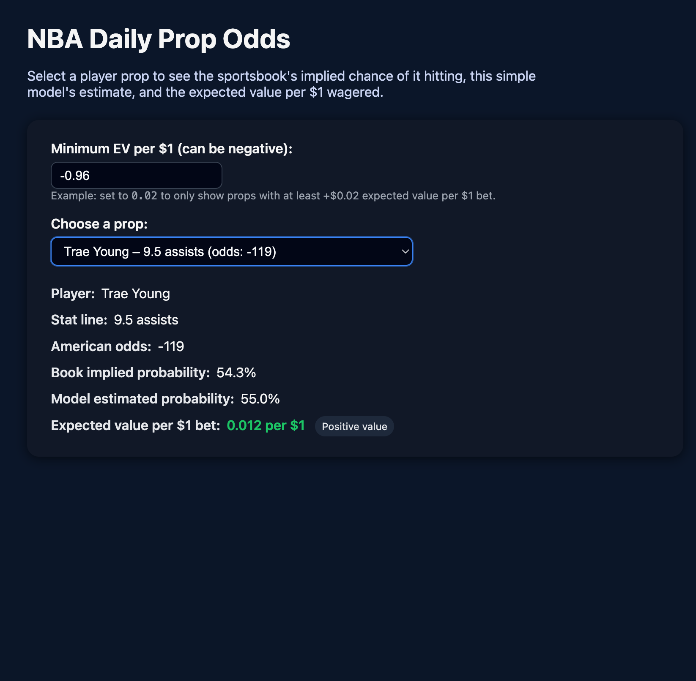

Write-up: 

## 1) Executive Summary

### Problem: 
When betting on NBA players on apps like PrizePicks, their player props can be difficult to gauge and determine whether they will yield a profit. Betters always consider the odds of a prop actually hitting and how likely it is to return a profit; however, there is no reliable tool to see these odds. Most betting apps will only show the line (an NBA player hitting a certain stat) without being able to see the expected value of their bet in a clear and concise way.


### Solution: 
This project leads the user to a simple web-based resource that helps bettors see the NBA player they are betting on in a more informed way using data. When looking at player props, for example, Stephen Curry scoring over 25.5 Points, instead of using your intuition to place your bet, this resource allows you to look at this player prop and immediately see the likelihood of a favorable or unfavorable bet through a basic model. The data comes from a small table of player props, each cell containing concise stats from each player, which is then calculated to produce the chance of a success and the expected return per dollar (expected value). Once calculated, the results are displayed where you can filter by value and compare with different players, allowing bettors to efficiently browse through different props. I customized this project to make it have similar props and results to PrizePicks bets.


## 2) System Overview

### Course Concepts: 
This project ties directly into several course concepts around modern service-based systems:

- **HTTP APIs & Web Services:**  
  The core of the project is a Flask API that exposes endpoints like `/health`, `/analyze`, and `/`. The `/analyze` endpoint is a clear example of a stateless, parameterized web service that other clients (browser, curl, or other code) can call.

- **Separation of Concerns / Layered Design:**  
  The numeric logic for probabilities and expected value lives in `pipeline.py`, while `app.py` is responsible for HTTP routing, configuration, and integration with external services. The UI is just a thin HTML/JavaScript layer that calls the API.

- **Configuration & Environment Variables:**  
  Runtime behavior (CSV vs. future odds API, port, optional vLLM server) is controlled via environment variables documented in `.env.example`, reflecting the idea of twelve-factor apps and configuration outside of code.

- **Containerization & Deployability:**  
  A `Dockerfile` shows how the service could be built and run in a container on any Docker-capable machine, illustrating portable deployment and the ability to run the same service image in different environments.

- **AI Integration (vLLM):**  
  The design includes hooks for a vLLM/OpenAI-compatible model server to generate explanations for the props, which connects to course ideas around ML/LLM-backed services without making the model a single point of failure.

---

### Architecture Diagram:


### Data/Models/Services:
- `assets/sample_props.csv`  
  - **Source:** Manually created to mimic PrizePicks-style NBA props (no scraped or proprietary data).  
  - **Size:** ~10–20 rows, 5 columns.  
  - **Format:** CSV (UTF-8).  
  - **License:** Included under this repo’s MIT License.
- 'pipeline.py'
  - **Implied probability + EV functions**  
  - **Source:** Custom code written for this project, using standard betting math for American odds.  
  - **Format:** Python functions producing numeric columns (`implied_prob`, `true_prob`, `ev_per_dollar`).  
  - **License:** MIT License.

- **Model probability (`model_prob` column)**  
  - **Source:** Manually assigned hit probabilities per prop in `sample_props.csv`.  
  - **Format:** Float values in `[0, 1]`.  
  - **License:** MIT License.

- 'app.py'
  - **Flask API (`src/app.py`)**  
  - **Endpoints:** `/health`, `/analyze`, `/` (HTML UI).  
  - **Format:** Python web service returning JSON and HTML.  
  - **License:** MIT License; uses open-source dependencies (Flask, pandas) under their own OSS licenses.

## 3) How to Run 
Using Docker:

```bash
# build
docker build -t nba-props-analyzer:latest .

# run
docker run --rm -p 8080:8080 nba-props-analyzer:latest

# health check
curl http://localhost:8080/health
```

Without Docker:

```bash
pip install -r requirements.txt
python src/app.py
```


## 4) Design Decisions

### Why this concept? Alternatives considered and why not chosen

I selected an NBA PrizePicks-style props analyzer since it fuses a variety of topics in the course (web services, simple models, configuration, optional AI integration) in one of the areas of my personal interest. One can implement end-to-end in a single semester with it, yet it is rich enough to demonstrate a real service with an API, user interface, and pipeline. The options I thought of consisted of: (1) a generic movie-rating recommender, and (2) a to-do list API. I have not selected them because they were less related to probabilistic reasoning and expected value, and would not emphasize the betting/odds style computations that make this project more interesting and unique.

### Tradeoffs: Performance, cost, complexity, maintainability

I intentionally did not have a complicated CSV + pandas pipeline and a more complex Flask app but rather used a lightweight set of microservices. This enables the code to remain lightweight to read, test, and extend and does not require an infrastructure cost or complexity (no database, no message queues, no cloud deployment). Its tradeoff is that this design would not have a conversion to very large datasets or to high-volume requests, but with a small props table and a single user, it is more than adequate. I also opted to use a very simple model (model_prob in the CSV) as an alternative to training a real ML model, which is to sacrifice accuracy in favor of clarity, maintainability, and time.

### Security/Privacy: Secrets management, input validation, PII handling

There is no user account or PII information in the present version; all the information concerns NBA players and synthetic prop that I invented. Sensitive configuration (e.g. odds API keys, vLLM endpoint URLs, etc) is not part of the code, but is described in.env.example so that secrets would be stored in a real .env file or environment variables not in the repo. Basic validation of query parameters such as min_ev is done and converted to numeric types which helps in reducing the risk of unwanted inputs leading to crashes. Since the app is read only and has no database, there is no user data to leak, nevertheless in a production deployment I would still like HTTPS, rate limiting and more robust input validation.

### Ops: Logs/metrics, scaling considerations, known limitations

This project is operationally a single Flask process, which is acceptable in a demo but is not at the level of production. The logging that is included with Flask would only give basic request logs, a more detailed (latency, error rates, number of requests per endpoint) set of metrics is not currently implemented but can be added by using a logging or observability library before the application, and scaling would involve running multiple instances behind an appropriate WSGI server (e.g. gunicorn) and a load balancer, and the proposed move to CSV to a real database or external API to get the props. Some of the known constraints are: fixed, hand-curated probabilities; no real odds API or vLLM service implemented; no authentication; and no anti-abuse measures beyond those of the simple Flask server.

## 5) Results & Evaluations
The screenshot below shows the main UI of the NBA Daily Prop Odds tool.  
In this example, the user has selected a Trae Young points prop, and the app displays:

- The stat line (9.5 points)
- American odds (-119)
- Book implied probability (54.3%)
- Model estimated probability (55.0%)
- Expected value per $1 bet (+0.012), highlighted as positive value



### Performance / Resource Footprint

- The app runs as a single Flask process and reads a small CSV (~10–20 rows), so CPU and memory usage are minimal.
- All calculations are simple numeric operations in pandas; responses for `/analyze` are effectively instantaneous on a laptop.

### Validation / Tests

- A pytest smoke test (`tests/test_pipeline.py`) loads `assets/sample_props.csv`, runs the `enrich_props` pipeline, and verifies that:
  - `implied_prob`, `true_prob`, and `ev_per_dollar` columns exist.
  - These columns contain non-null values.
- Manual validation: I checked several props by hand to confirm that:
  - Implied probabilities match the American odds formulas.
  - EV per $1 changes appropriately when `model_prob` changes.

## 6) What's Next? 

- **Live odds and auto-updating model:**  
This program currently uses a static CSV, and a big next step is connecting the service to a live data source so we can update the line and probabilities throughout the day. For this we can (a) find an odds API with a documented way to read that data or (b) web scrape lines from betting sites that allow it and pipe it into `pipeline.py`. Then, for each game, a `model_prob` might be fed with live lines, log of games just played, or a small historical model, to keep the EV numbers from being just a one-off snapshot.

- **Richer UI and user controls:**  
I would love to have more filtering and visualization options on the front-end. I think it would be great to have the ability to filter by team, filter by market (points, rebounds, threes), toggle for only positive EV, and little charts with EV versus line shift or change in odds. Another change to styling could also include different colors for positive and negative EV and potential tooltips for each metric, making a more PrizePicks-like experience.

## 7) Links
GitHub Repo: https://github.com/mknoww/nba-props-analyzer  

